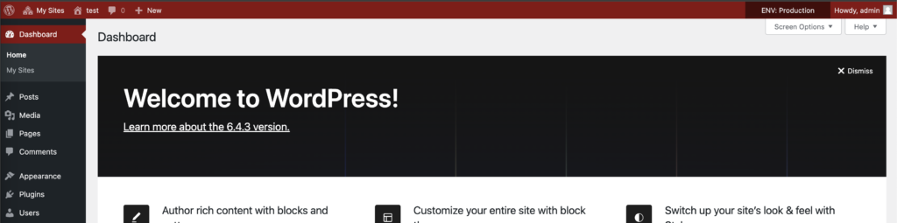
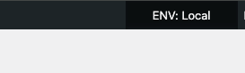
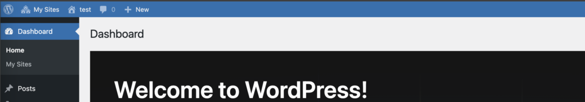
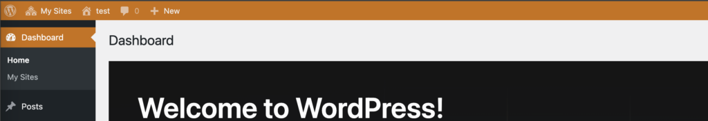

# Colorize WordPress adminpanel for environments

[](https://packagist.org/packages/renakdup/colorize-wp-adminpanel-for-environments) [](https://packagist.org/packages/renakdup/colorize-wp-adminpanel-for-environments) [](https://packagist.org/packages/renakdup/colorize-wp-adminpanel-for-environments) [](https://packagist.org/packages/renakdup/colorize-wp-adminpanel-for-environments)

Confusing development environments is easy, especially when working under deadline pressure, on multiple projects
simultaneously, or simply due to human error.

One effective way to solve this problem is by visually distinguishing the WordPress admin panel with different colors
depending on the development environment. This approach not only increases the developers’ level of attentiveness but
also facilitates faster and more intuitive differentiation between environments, reducing the likelihood of errors.



[Read more in the article](https://wp-yoda.com/en/wordpress/color-highlighting-of-the-wordpress-admin-panel-for-different-environments/)

## Installation

1. Specify your current environment.  
   On each environment (local, development, qa, stage, production), you will need to add the `WP_ENVIRONMENT_TYPE`
   constant with its value to `wp-config.php`.   
   Choose the necessary one and add it into your config:
    ```php
    define( 'WP_ENVIRONMENT_TYPE', 'local' );
    define( 'WP_ENVIRONMENT_TYPE', 'development' );
    define( 'WP_ENVIRONMENT_TYPE', 'staging' );
    define( 'WP_ENVIRONMENT_TYPE', 'production' );
    ```
2. Install via Composer
    ```bash
   composer require renakdup/colorize-wp-adminpanel-for-environments
    ```

> [!NOTE]
> If you don't use Composer copy this file here `/wp-content/mu-plugins/` https://gist.github.com/renakdup/36f4a8474d0cb13ecadf0393811d5330  
> ! There are no need additional steps anymore.

3. Add the file `/wp-content/mu-plugins/colorize-adminpanel-for-environments.php`

```php
<?php

if ( ! class_exists( Renakdup\AdminpanelEnvColor\AdminpanelEnvColor::class ) ) {
	return;
}

Renakdup\AdminpanelEnvColor\AdminpanelEnvColor::init();
```

**That's it!**

## Features

The right corner of admin-bar will be displayed current environment  


### Other colors

Development:  

---
Staging:  

---
Production:  


## Change colors

By the default we use next colors:

- production: red
- staging: orange
- development: blue
- local: default black

You can change it and add your new envs as well

```php
add_filter( 'renakdup/adminpanel_env_color/colors', function ( $defaults ) {
	return array_merge( 
		$defaults, 
		[
			'local' => 'green',
			'custom-env' => '#CCC'
		]
	);
}, 10, 1 );
```
